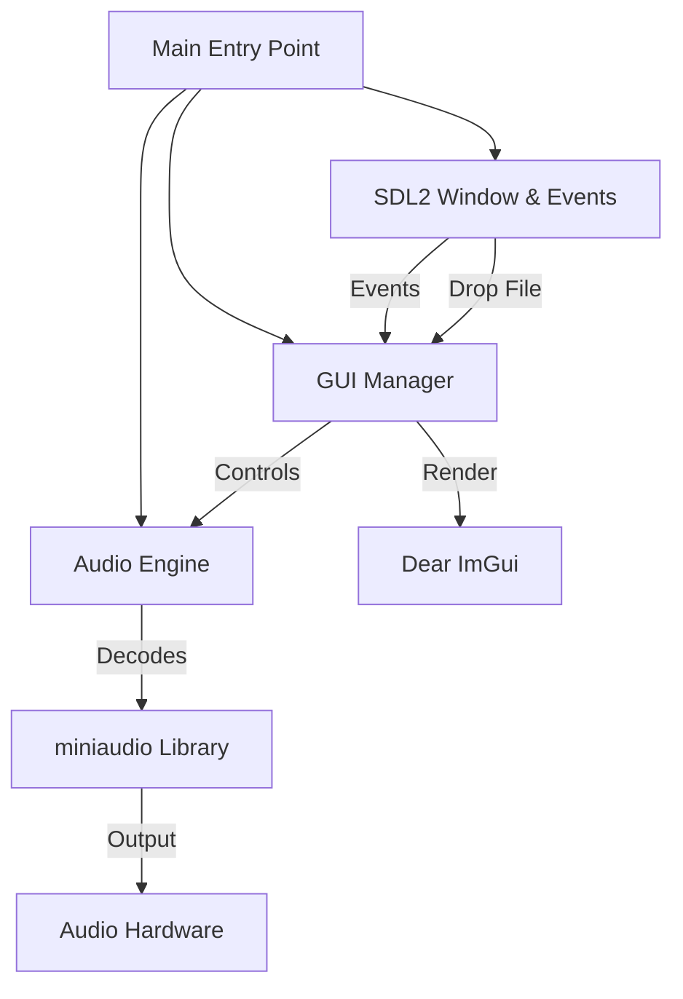

# C++ Music Player

A high-performance, cross-platform Music Player built with C++17, SDL2, Dear ImGui, and miniaudio.

## 🌟 Features
- **Playback**: Play, Pause, Stop, Seek.
- **Format Support**: MP3, WAV.
- **High Quality Audio**: 48kHz Stereo with 32-bit Float precision.
- **Drag and Drop**: Drag music files directly into the window.
- **Playlist Management**: Automatically loads from `~/Music`, local `music` folder, and supports adding files dynamically.
- **Volume Control**: Real-time volume adjustment.
- **GUI**: Modern, responsive interface using Dear ImGui.

## 🏗 System Design

### Architecture
The application follows a modular architecture separating the Audio Engine, GUI, and Core Application logic.



### Class Overview

#### 1. `AudioEngine` (`src/AudioEngine.h`, `src/AudioEngine.cpp`)
Handles all low-level audio operations.
- **Responsibilities**:
    - Initialize/Shutdown `miniaudio` engine.
    - Load and decode audio files.
    - Play, Pause, Stop, Seek control.
    - Volume management.
    - Time tracking (Current time, Total duration).
- **Key Methods**:
    - `Init()`: Configures engine with 48kHz sample rate and 100ms buffer.
    - `PlayFile(path)`: Loads and starts playback.
    - `SeekToTime(seconds)`: Seeks to specific timestamp.

#### 2. `GUI` (`src/GUI.h`, `src/GUI.cpp`)
Manages the user interface and interaction.
- **Responsibilities**:
    - Render Player Controls (Buttons, Sliders, Progress Bar).
    - Render Playlist.
    - Handle Drag and Drop file additions.
    - Interface with `AudioEngine`.
- **Key Methods**:
    - `Render()`: Main render loop called every frame.
    - `AddFileToPlaylist(path)`: Validates and adds files.
    - `LoadPlaylist(dir)`: Scans directories for music.

#### 3. `main` (`src/main.cpp`)
Application entry point and event loop.
- **Responsibilities**:
    - Initialize SDL2 and OpenGL/Metal context.
    - Initialize ImGui.
    - Main Event Loop (Poll events, Handle Input).
    - Coordinate `GUI` rendering and `AudioEngine` updates.

## 🧠 Data Structures & Algorithms Showcase
This project demonstrates the practical application of custom data structures to solve real-world problems, avoiding standard library containers where performance or specific behavior is required.

### 1. Doubly Linked List (Playlist Management)
- **File**: `src/PlaylistDLL.h`
- **Problem**: `std::vector` requires O(N) shifting for insertions/deletions and doesn't natively support efficient bidirectional traversal state.
- **Solution**: Implemented a custom **Doubly Linked List**.
- **Complexity**:
    - **Next/Prev Track**: **O(1)** (Instant access via pointers).
    - **Insertion/Deletion**: **O(1)** (No memory shifting).
- **Key Features**: Manual memory management, pointer manipulation.

### 2. Trie / Prefix Tree (Search Engine)
- **File**: `src/SongTrie.h`
- **Problem**: Searching a playlist of N songs using linear scan is **O(N*M)** (where M is string length).
- **Solution**: Implemented a **Trie (Prefix Tree)** for the search bar.
- **Complexity**: **O(M)** lookup time, independent of playlist size N.
- **Key Features**: Recursive tree traversal, efficient string prefix matching.

## 🛠 Dependencies
- **SDL2**: Windowing, Input, Event Handling.
- **Dear ImGui**: Immediate Mode GUI for rendering.
- **miniaudio**: Single-header audio playback library.
- **CMake**: Build system.

## 🚀 Build and Run

### Prerequisites
- **macOS**: Xcode Command Line Tools, Homebrew.
- **Windows/Linux**: CMake, C++ Compiler (MSVC/GCC/Clang).

## Build Instructions

### macOS
1. Install CMake and SDL2:
   ```bash
   brew install cmake sdl2
   ```
2. Build the project:
   ```bash
   mkdir build
   cd build
   cmake ..
   make
   ```
3. Run the application:
   - **Standalone App**: Open `build/MusicPlayer.app`
   - **Terminal**: `./MusicPlayer`

### Windows
1. Install [CMake](https://cmake.org/download/).
2. Install a C++ compiler (e.g., [MinGW](https://www.mingw-w64.org/) or Visual Studio).
3. Install [SDL2](https://github.com/libsdl-org/SDL/releases).
   - If using MinGW, download the development libraries (MinGW version).
   - Extract and set `SDL2_DIR` environment variable to the extracted folder.
4. Build the project:
   ```bash
   mkdir build
   cd build
   cmake -G "MinGW Makefiles" ..
   mingw32-make
   ```
5. Run the application:
   ```bash
   MusicPlayer.exe
   ```

## Packaging

To create a standalone distributable package:

### macOS (DMG)
```bash
cd build
cmake ..
make package
```
This will generate a `.dmg` file in the `build` directory.

### Windows (ZIP)
```bash
cd build
cmake -G "MinGW Makefiles" ..
mingw32-make package
```
This will generate a `.zip` file containing the executable and necessary DLLs (if found).

## 📖 Usage Guide
1. **Adding Music**:
   - **Drag & Drop**: Drag `.mp3` or `.wav` files into the window.
   - **Auto-Load**: Place files in your `~/Music` folder or a `music` folder next to the app.
2. **Controls**:
   - **Play/Pause**: Toggle playback.
   - **Stop**: Stop and reset to beginning.
   - **Seek**: Click anywhere on the progress bar.
   - **Volume**: Drag the slider to adjust volume.
   - **Playlist**: Click a song name to play it.

## ⚙️ Configuration
- **Sample Rate**: Auto-detect (Defaults to device, usually 48kHz).
- **Buffer Size**: 100ms (Optimized for stability).
- **Frame Rate**: VSync enabled (60/120 FPS).

## 🤝 Contributing
1. Fork the repository.
2. Create a feature branch.
3. Commit your changes.
4. Open a Pull Request.

## 📄 License
This project is open source.